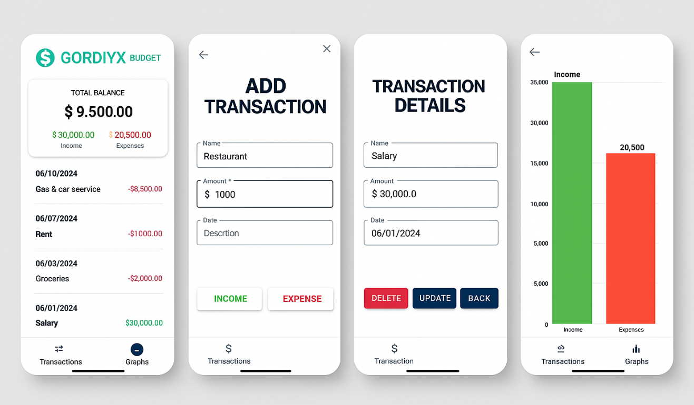

# 💸 Budget Tracker

**Budget Tracker** is a simple and intuitive Android app that helps you track your income and expenses. Visualize your financial habits, manage your money more efficiently, and reach your financial goals.

---

## 📱 Screenshots

---

## 🧩 Features

- ✅ **Add income and expenses** with labels, dates, amounts, and descriptions.
- 📊 **Bar chart** visualization of income vs expenses.
- 📅 **Grouped transactions by date** for easy tracking.
- ✏️ **Edit and delete transactions** anytime.
- 📈 **Dashboard summary** with current balance, total income, and total expenses.
- 🔍 Simple navigation using **BottomNavigationView**.

---

## ⚙️ Tech Stack

- **Kotlin**
- **Android SDK**
- **Room (SQLite)** – local database
- **Kotlin Coroutines** – background operations
- **MPAndroidChart** – chart library
- **Material Components** – for modern UI/UX

